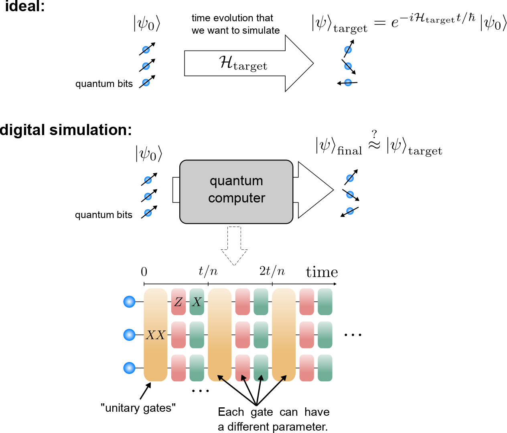

# Q-learning applied to quantum digitial simulations.

This repository contains the files that I used for my current research project.

In quantum computing, a [quantum gate](https://en.wikipedia.org/wiki/Quantum_logic_gate) is a basic operation (mathematically, a unitary matrix) applied to a small number of quantum bits (qubits).

One promising short-term application of quantum computers is to simulate quantum many-body dynamics [3, 4]. However, it is a challenge to optimize the algorithms according to the resources available today.

A quantum computer has at its disposal a _universal set of gates_.
Namely, any unitary can be approximated to any desired accuracy with the right sequence of quantum gates.
But how can we find this sequence of gates? 
In some cases, there exist some systematic methods (e.g. the Trotter-Suzuki decomposition), but they usually fail on large time scales and require a unrealistically large amount of gates.

## A quantum compiler:
The goal of the project is to __use reinforcement learning to find an optimal sequence of quantum gates__, to reproduce the dynamics of a given quantum many-body system. We train an "agent" how to optimally choose a gate given the current state of the system.

[3] S. Lloyd, Science 273, 1073 (1996). 
[4] E. A. Martinez, et al., Nature 534, 516 (2016).

# Description of the files:

- [`main_DQL.py`](main_DQL.py): main program when using a deep Q-learning algorithm.

- [`main_qlearning.py`](main_qlearning.py): main program when using a tabular TD(λ) algorithm (Q-learning with eligibility traces)

- [`systems.py`](systems.py): contains classes defining the physical system (e.g. it defines the target Hamiltonian, the quantum gates, and the matrix operations needed to calculate the dynamics).

- [`environements.py`](environements.py): contains classes defining different environments (e.g. how "actions" and "states" are defined. There are variations for both discrete and continuous problems).

- [`q_learning.py`](q_learning.py): contains classes defining tabular Q-learning algorithms (e.g. TD(λ)).

- [`deep_q_learning.py`](deep_q_learning.py): contains classes defining deep Q-learning algorithms / deep Q-networks (DQN).

- [`models.py`](models.py): contains classes for the neural networks used by `deep_q_learning.py`.

- [`parameters.py`](parameters.py): contains a dictionary of all the parameters for the environement and the algorithms.

- [`results`](results): subdirectory containing tools to process and inspect/explore the results. The results themselves are heavy and stored locally.
  - [`process_results.py`](results/process_results.py): process the raw results obtained from the main programs into something that can be used easily.
  - [`plots/plots.py`](results/plots/plots.py): contains several functions that define plots to inspect the result data.
  - [`view_results.ipynb`](results/view_results.ipynb): jupyter notebook used to plots various graphs describing the results conveniently.
  - [`database.py`](results/database.py): manages a database containing information about the status of the computations.
  - [`status_database.json`](results/status_database.json): the corresponding database.
  - [`info_database.py`](results/info_database.py): manages a database containing the parameters and other useful information about the processed result data.
  - [`info_database.json`](results/info_database.json): the corresponding database.
